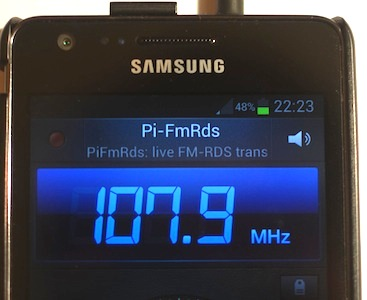

Pi-FM-RDS
=========


## FM-RDS transmitter using the Raspberry Pi's PWM

This program generates an FM modulation, with RDS (Radio Data System) data generated in real time.

It is based on the FM transmitter created by [Oliver Mattos and Oskar Weigl](http://www.icrobotics.co.uk/wiki/index.php/Turning_the_Raspberry_Pi_Into_an_FM_Transmitter), and later adapted to using DMA by [Richard Hirst](https://github.com/richardghirst). Christophe Jacquet adapted it and added the RDS transmitter.


## How to use it?

To build Pi-FM-RDS, depends on the `sndfile` library. On Debian-like distributions, for instance Raspbian, run `sudo apt-get install libsndfile1-dev`.

Then clone the source repository and run `make` in the `src` directory:

```bash
git clone https://github.com/ChristopheJacquet/PiFmRds.git
cd PiFmRds/src
make
```

Then you can just run:

```
sudo ./pi_fm_rds
```

This will generate an FM transmission on 107.9 MHz, with default station name (PS), radiotext (RT) and PI-code, without audio. The radiofrequency signal is emitted on GPIO 4 (pin 7 on header P1).


You can add monophonic sound by referencing a WAV file as follows:

```
sudo ./pi_fm_rds -wav sound.wav
```

**Current limitation: the WAV file must be sampled at 228 kHz. Use for instance the two files provided, `sound.wav` and `pulses.wav`.**

The more general syntax for running Pi-FM-RDS is as follows:

```
pi_fm_rds [-freq freq] [-wav file.wav] [-ppm ppm_error] [-pi pi_code] [-ps ps_text] [-rt rt_text]
```

All arguments are optional:

* `-freq` specifies a frequency (in MHz). Example: `-freq 87.5`.
* `-wav` specifies a WAV file to play. It must be sampled at 228 kHz, but no frequency above 18 kHz must be present. Example: `-wav sound.wav`.
* `-ppm` specifies your Raspberry Pi's oscillator error in parts per million (ppm), see below.
* `-pi` specifies the PI-code of the RDS broadcast. 4 hexadecimal digits. Example: `-pi FFFF`.
* `-ps` specifies the station name (Program Service name, PS) of the RDS broadcast. Limit: 8 characters. Example: `-ps RASP-PI`.
* `-rt` specifies the radiotext (RT) to be transmitted. Limit: 64 characters. Example: `-rt 'Hello, world!'`.

By default the PS changes back and forth between `Pi-FmRds` and a sequence number, starting at `00000000`. The PS changes around one time per second.


### Clock calibration (if experiencing difficulties)

The RDS standards states that the error for the 57 kHz subcarrier must be less than ± 6 Hz, i.e. less than 105 ppm (parts per million). The Raspberry Pi's oscillator error may be above this figure. That is where the `-ppm` parameter comes into play: you specify your Pi's error and Pi-FM-RDS adjusts the clock dividers accordingly.

In practice, I found that Pi-FM-RDS works okay even without using the `-ppm` parameter. I suppose the receiver are more tolerant than the RDS spec.

One way to measure the ppm error is to play the `pulses.wav` file: it will play a pulse for precisely 1 second, then play a 1-second silence, and so on. Record the audio output from a radio with a good audio card. Say you sample at 44.1 kHz. Measure 10 intervals. Using [Audacity](http://audacity.sourceforge.net/) for measure determine the number of samples of these 10 intervals: in the absence of clock error, it should be 441,000 samples. With my Pi, I found 441,132 samples. Therefore, my ppm error is (441132-441000)/441000 = 299 ppm, **assuming that my sampling device has no clock error...**


## Diclaimer

Never use this program to transmit VHF-FM data through an antenna, as it is
illegal in most countries. This code is for experimental purposes only.
Always connect a shielded transmission line from the RaspberryPi directly
to a radio receiver, so as **not** to emit radio waves.


## Tests

Pi-FM-RDS was successfully tested with all my RDS-able devices, namely:

* a Sony ICF-C20RDS alarm clock from 1995,
* a Sangean PR-D1 portable receiver from 1998,
* a Samsung Galaxy S2 mobile phone from 2011,
* a Philips MBD7020 hifi system from 2012,
* a Silicon Labs [USBFMRADIO-RD](http://www.silabs.com/products/mcu/Pages/USBFMRadioRD.aspx) USB stick, employing an Si4701 chip, using my [RDS Surveyor](http://rds-surveyor.sourceforge.net/) program,
* a “PCear Fm Radio”, a Chinese clone of the above, again using RDS Surveyor.

Reception works perfectly with all the devices above. RDS Surveyor reports no group errors.



## Design

The RDS data generator lies in the `rds.c` file.

The RDS data generator generates cyclically four 0A groups (for transmitting PS), and one 2A group (for transmitting RT). `get_rds_group` generates one group, and uses `crc` for computing the CRC.

To get samples of RDS data, call `get_rds_samples`. It calls `get_rds_group`, differentially encodes the signal and generates a shaped biphase symbol. Successive biphase symbols overlap: the samples are added so that the result is equivalent to applying the shaping filter (a [root-raised-cosine (RRC) filter ](http://en.wikipedia.org/wiki/Root-raised-cosine_filter) specified in the RDS standard) to a sequence of Manchester-encoded pulses.

The shaped biphase symbol is generated by a Python program called `generate_waveforms.py` that uses [Pydemod](https://github.com/ChristopheJacquet/Pydemod), one of my other software radio projects. This Python program generates an array called `waveform_biphase` that results from the application of the RRC filter to a positive-negative impulse pair.

The samples are played by `pi_fm_rds.c` that is adapted from Richard Hirst's [PiFmDma](https://github.com/richardghirst/PiBits/tree/master/PiFmDma). The program was changed to support a sample rate of precisely 228 kHz, four times the RDS subcarrier's 57 kHz.

### References

* [EN 50067, Specification of the radio data system (RDS) for VHF/FM sound broadcasting in the frequency range 87.5 to 108.0 MHz](http://www.interactive-radio-system.com/docs/EN50067_RDS_Standard.pdf)


--------

© [Christophe Jacquet](http://www.jacquet80.eu/) (F8FTK), 2014. Released under the GNU GPL v3.